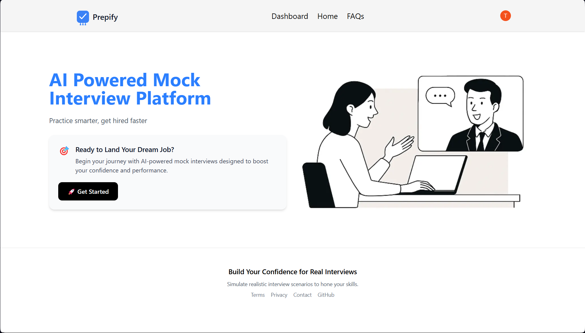
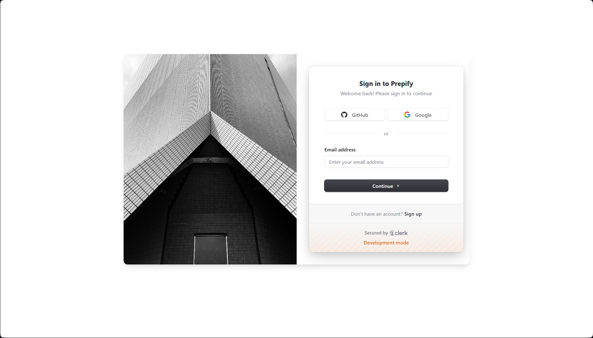
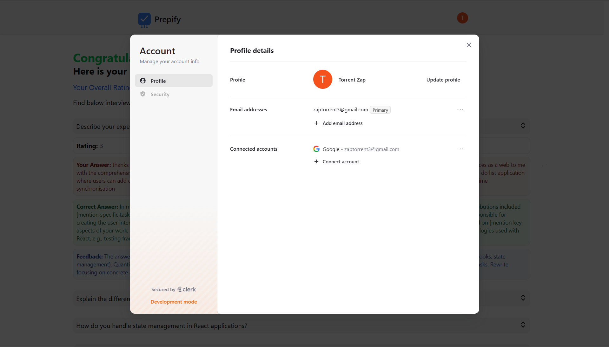
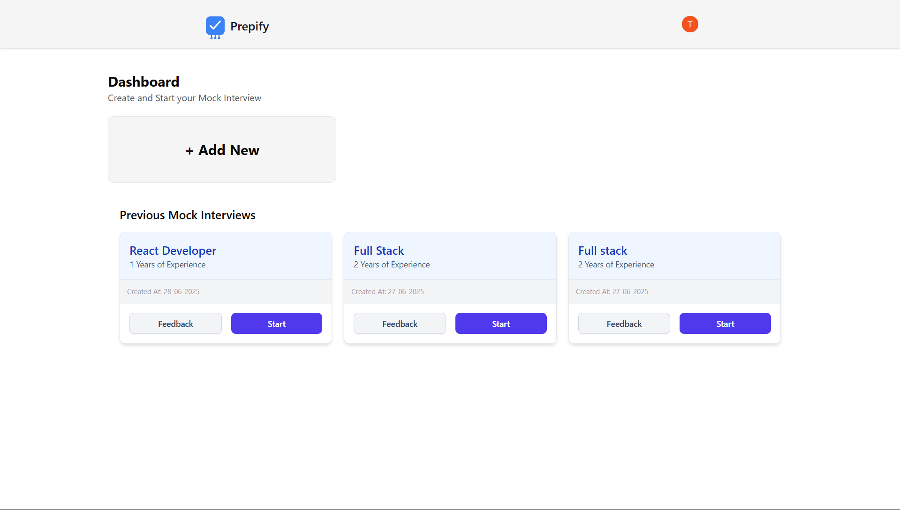
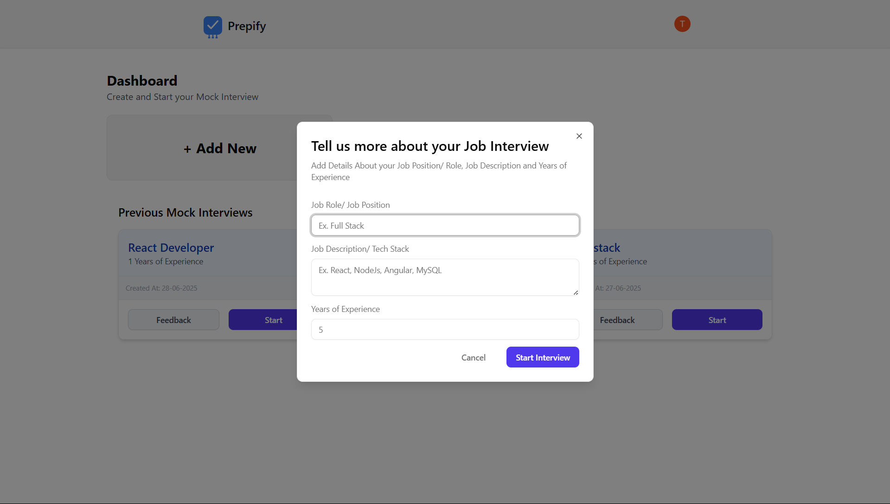
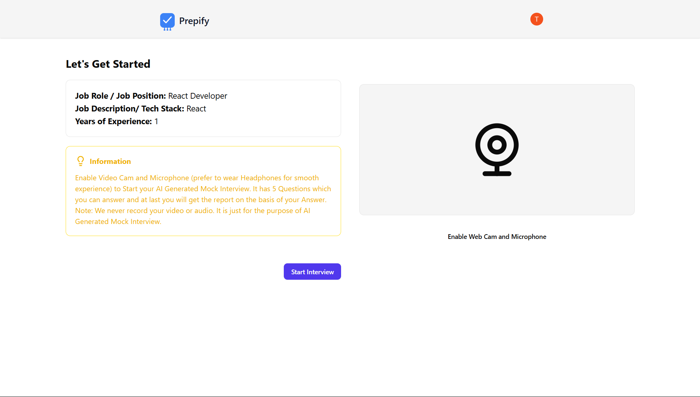
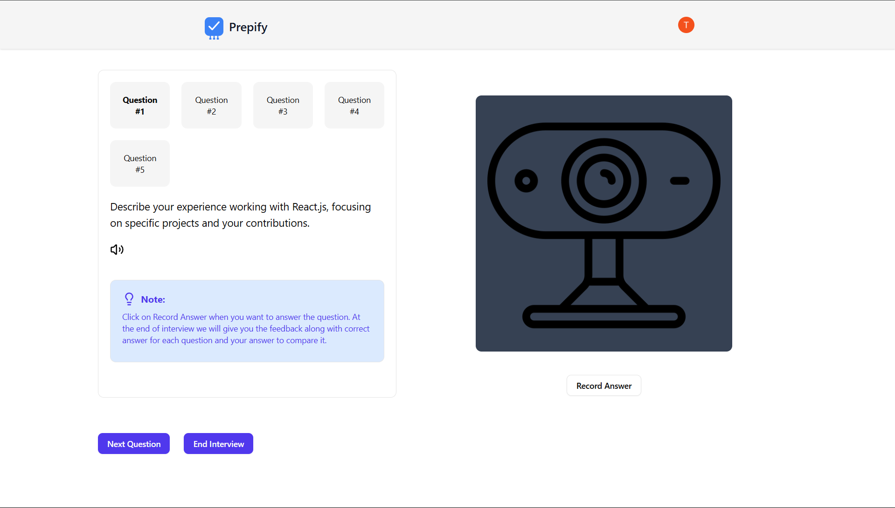
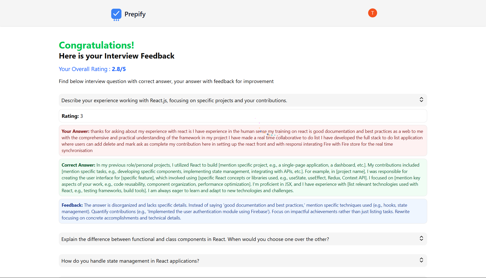

# 🧠 Prepify – AI Powered Mock Interview Platform

## ❓ Problem Statement

Preparing for job interviews can be daunting. Most candidates lack access to personalized, realistic, and feedback-driven practice environments. Mock interviews with real people are hard to schedule, inconsistent, and sometimes intimidating — making it difficult to improve and build confidence.

## ✅ Solution

**Prepify** solves this by offering an **AI-powered mock interview experience** that mimics real interviews and provides actionable feedback instantly. From question generation to performance evaluation, everything is handled with smart automation and privacy in mind.

---

## 🔗 Live Project

👉 [Visit Prepify Live](https://prepify-ai-powered-mock-interview-p.vercel.app)

---

## 🌟 Features

- 🎯 Generates **custom interview questions** for the chosen job role using **Gemini AI**.
- 🎙️ Enables **recording of video and audio answers** for realistic mock sessions.
- 📝 **Transcribes speech to text** for better analysis and response tracking.
- 🤖 Provides **instant AI feedback** on both technical and soft skills.
- 📚 Shows **model answers** to guide users in structuring their responses.
- 🔐 Ensures a **secure and private** environment — no media is stored.

---

## 📑 Table of Contents

- [🧠 Prepify – AI Powered Mock Interview Platform](#prepify--ai-powered-mock-interview-platform)
  - [❓ Problem Statement](#problem-statement)
  - [✅ Solution](#solution)
  - [🌟 Features](#features)
  - [📸 Screenshots](#screenshots)
  - [💻 Tech Stack](#tech-stack)
  - [🚀 Getting Started Locally](#getting-started-locally)
  - [🔗 Live Project](#live-project)

---

## 📸 Screenshots

| Description          | Screenshot                                            |
| -------------------- | ----------------------------------------------------- |
| Landing Page         |        |
| Login / Signup Page  |           |
| User Profile         |                 |
| Dashboard            |              |
| Add New Interview    |  |
| Start Interview      |  |
| Interview in Process |              |
| Feedback Page        |                |

---

## 💻 Tech Stack

| **Category** | **Technologies**         | **Description**                                         |
| ------------ | ------------------------ | ------------------------------------------------------- |
| **Frontend** | Next.js                  | React-based framework for server-side rendering and SPA |
|              | Tailwind CSS             | Utility-first CSS for rapid UI development              |
| **Backend**  | Drizzle ORM + PostgreSQL | Type-safe queries + scalable relational DB              |
| **AI**       | Gemini AI                | AI question generation + model answer creation          |
| **Auth**     | Clerk                    | Secure user authentication and session mgmt             |
| **Media**    | WebRTC / MediaRecorder   | Handles real-time video/audio recording                 |
| **Other**    | Vercel                   | Deployment and hosting                                  |

---

## 🚀 Getting Started Locally

### 1️⃣ Clone the Repository

```bash
git clone https://github.com/purveshjambhulkar/Prepify---AI-powered-Mock-Interview-Platform.git
```

### 2️⃣ Install Dependencies

```bash
npm install
```

### 3️⃣ Configure Environment Variables

Create a `.env.local` file and add the following:

```env
NEXT_PUBLIC_CLERK_PUBLISHABLE_KEY=clerk_publishable_key
CLERK_SECRET_KEY=clerk_secret_key

NEXT_PUBLIC_CLERK_SIGN_UP_URL=/sign-up
NEXT_PUBLIC_CLERK_SIGN_UP_FALLBACK_REDIRECT_URL=/
NEXT_PUBLIC_CLERK_SIGN_IN_FALLBACK_REDIRECT_URL=/

NEXT_PUBLIC_CLERK_SIGN_IN_URL=/sign-in
NEXT_PUBLIC_CLERK_SIGN_IN_FALLBACK_REDIRECT_URL=/
NEXT_PUBLIC_CLERK_SIGN_UP_FALLBACK_REDIRECT_URL=/

NEXT_PUBLIC_DRIZZLE_DB_URL=drizzle_db_url


NEXT_PUBLIC_GEMINI_API_KEY=gemini_api_key

NEXT_PUBLIC_INTERVIEW_QUESTION_COUNT=5

NEXT_PUBLIC_INFO="Enable Video Cam and Microphone (prefer to wear Headphones for smooth experience) to Start your AI Generated Mock Interview. It has 5 Questions which you can answer and at last you will get the report on the basis of your Answer. Note: We never record your video or audio. It is just for the purpose of AI Generated Mock Interview."

NEXT_PUBLIC_QUESTION_NOTE="Click on Record Answer when you want to answer the question. At the end of interview we will give you the feedback along with correct answer for each question and your answer to compare it."
```

### 4️⃣ Run the Application

```bash
npm run dev
```

Visit: [http://localhost:3000](http://localhost:3000)

---
